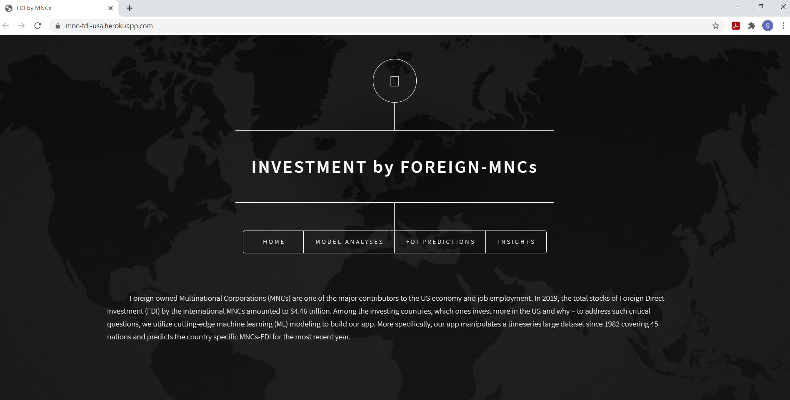
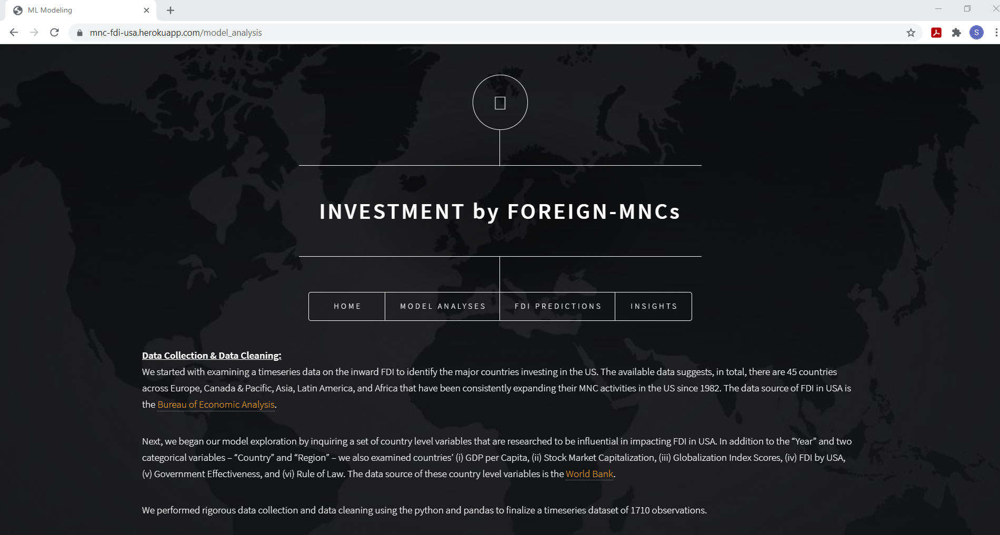
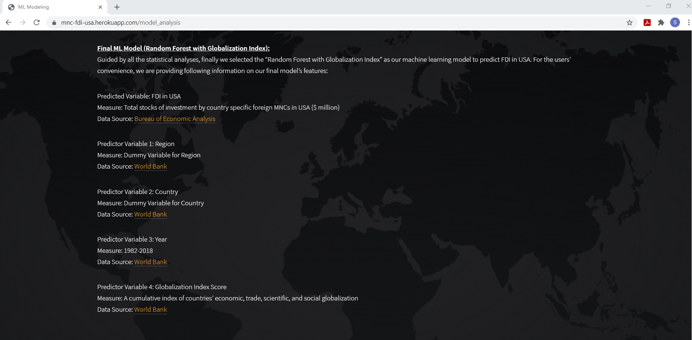
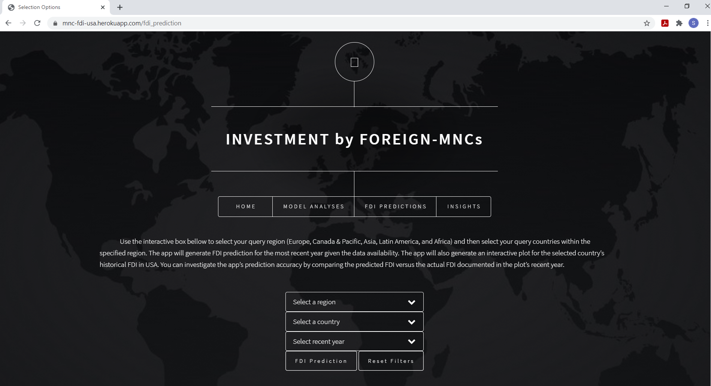
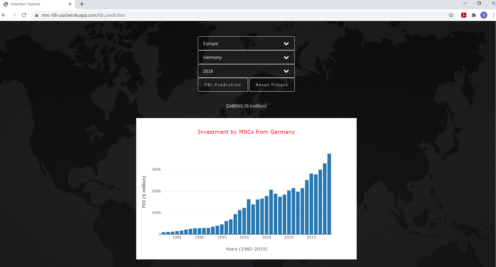
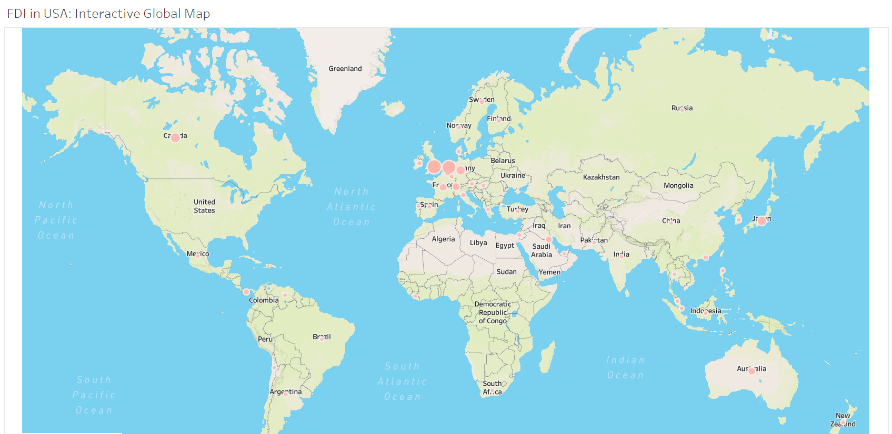
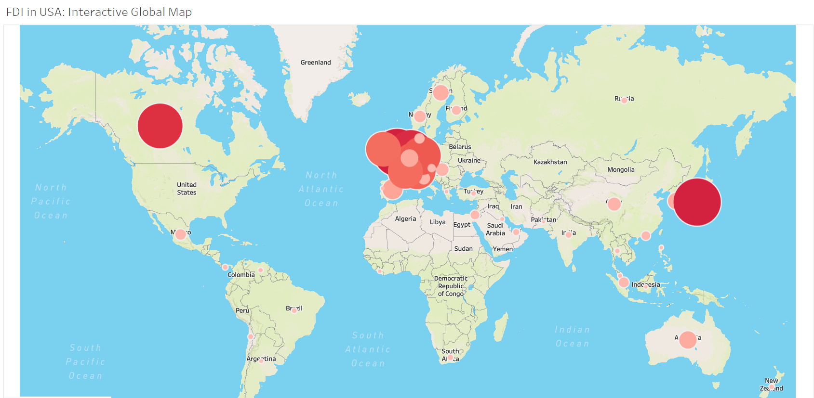

##### Data Analysis & Visualization Bootcamp | UT-Austin McCombs | Spring 2021

# **Investment by Foreign-MNCs**
#### App Link: https://mnc-fdi-usa.herokuapp.com/ 

Foreign owned Multinational Corporations (MNCs) are one of the major contributors to the US economy and job employment. In 2019, the total stocks of Foreign Direct Investment (FDI) by the international MNCs amounted to USD 4.46 trillion. Among the investing countries, which ones invest more in the US and why – to address such critical questions, we utilize cutting-edge machine learning (ML) modeling to build an app. More specifically, our app manipulates a timeseries large dataset since 1982 covering 45 nations and predicts the country specific MNCs-FDI for the most recent year. 
* First, the users can select a desired continent/region, which includes the options of Europe, Canada & Pacific, Asia, Latin America, & Africa.
* Within the desired continent/region, the users can select a particular country for which the predicition of "FDI in USA" will be generated for that country's "MNCs in USA".
* Finally, the users can select the most recent year for which prediction will be generated given the data availability. 
* At present, the recent year of prediction is 2019.
* In addition to the predicted FDI (in million dollar), the app will also produce an interactive plot summarizing the MNCs-FDI for the selected country since 1982.  
* The users can compare the predicted value of FDI with the real value of FDI, which will be documented in the interactive plot's recent year visualization.

##### **Home Page:**

## Machine Learning Modeling
We started with examining a timeseries data on the inward FDI to identify the major countries investing in the US. The available data suggests, in total, there are 45 countries across Europe, Canada & Pacific, Asia, Latin America, and Africa that have been consistently expanding their MNC activities in the US since 1982. The data source of FDI in USA is the Bureau of Economic Analysis. Next, we began our model exploration by inquiring a set of country level variables that are researched to be influential in impacting FDI in USA. In addition to the “Year” and two categorical variables – “Country” and “Region” – we also examined countries’ (i) GDP per Capita, (ii) Stock Market Capitalization, (iii) Globalization Index Scores, (iv) FDI by USA, (v) Government Effectiveness, and (vi) Rule of Law. The data source of these country level variables is the World Bank. We performed rigorous data collection and data cleaning using the python and pandas to finalize a timeseries dataset of 1710 observations. 
* Based on the results of our statistical tests, we decided to examine five potential models – (i) a model with FDI by USA, (ii) a model with GDP per Capita, (iii) a model with Globalization Index, (iv) a model with Rule of Law index, and (v) a model with all four variables (FDI by USA, GDP per Capita, Globalization Index, and Rule of Law). 
* For each of these five models, we tested a series of Linear Regressions, Regressions with Interactions, Lasso Regressions, Decision Tree, and Random Forest. * Our findings suggest that the “Random Forest with Globalization Index” is the best machine learning model to predict FDI in USA. According to the K-Fold Cross-Validation, the mean square error is the smallest for this model. 
* For generic validation, the Ordinary Least Square (OLS) results suggest that the coefficient is meaningfully and significantly interpretable for the “Globalization Index” – “for each unit increase in countries’ Globalization Index, their FDI in USA increases by 691.99 million”.
* Also the P-Value and F-Statistic of the OLS test rejected the null model and provided support for the Globalization Index model as a good model.

##### **Model Analyses Page (i):**

##### **Model Analyses Page (ii):**

## Predicting FDI by MNCs
Guided by all the statistical analyses, finally we selected the “Random Forest with Globalization Index” as our machine learning model to predict FDI in USA. For the users’ convenience, our app provided the following information:
* Predicted Variable: FDI in USA. Measure: Total stocks of investment by country specific foreign MNCs in USA. Data Source: Bureau of Economic Analysis, https://www.bea.gov.
* Predictor Variable 1: Region. Measure: Dummy Variable for Region. Data Source: World Bank, https://data.worldbank.org.
* Predictor Variable 2: Country. Measure: Dummy Variable for Country. Data Source: World Bank, https://data.worldbank.org.
* Predictor Variable 3: Year. Measure: 1982-2018. Data Source: World Bank, https://data.worldbank.org.
* Predictor Variable 4: Globalization Index Score. Measure: A cumulative index of countries’ economic, trade, scientific, and social globalization. Data Source: World Bank, https://data.worldbank.org.

##### **FDI Predictions Page (i):**

##### **FDI Predictions Page (ii):**

## Machine Learning App Insights
* The data analyses provide critical insights regarding the relationship between investing countries’ globalization trends and their investments in USA. While the recent waves of nationalism cast doubts over globalization, the amount of FDI in USA depicts a different scenario. Over the years, foreign MNCs have been continuously expanding their business activities and job employments in the American market. As the machine learning modeling suggests, higher the foreign countries’ scores in Globalization Index, higher their possibilities of investment in USA.
* The app presents the ranking of top regions by their average investment in USA. Canada & Pacific and Europe have been the leading regions for the FDI by their MNCs. However, it is important to point out that overtime with the increase in Globalization Index scores, many countries from Asia, Latin America, and Africa are emerging as key players in FDI and thereby, expanding their MNC activites in USA.
* The app also presents the ranking of top 25 countries by their average investment in USA. In line with the above discussed analysis, majority of the top 25 countries belong to the European (UK, Netherlands, Germany, France, Switzerland, Luxembourg, Ireland, Belgium, Sweden, Spain, Hungary, Italy, Norway, Denmark, and Finland) and Canada & Pacific (Canada and Australia) regions. However, a growing number of countries from the Asian (Japan, South Korea, Singapore, China, Israel, and Hong Kong) and Latin American (Mexico and Panama) regions are emerging as influential investors and owners of foreign MNCs in USA.

##### **Insights Page: Global Map of FDI by MNCs (1982)**

##### **Insights Page: Global Map of FDI by MNCs (2018)**

## Applied Technologies:

* Python, Pandas, & Scikit Learn
* Machine Learning Modeling
* HTML, CSS, & Jinja
* JavaScript & D3
* Plotly Visualizations
* Flask
* Heroku

## Limitations & Future Updates:
* Our app predicts the FDI by majority of the countries with reasonable accuracy. It is important to emphasize that the country level machine learning modeling often deals with generating estimations of million/trillion dollars (as unit size). Also, researcher and policymakers caution us to be careful regarding the intentional or unintentional bias about country level data. For example, the country level Globalization Index scores are relatively higher for Greece, Portugal, Malaysia, Philippines, and Argentina. Therefore, the app predicted FDI by these countries are higher compared to the actual FDI. Besides such limited instances of over-valuation, however, our app fairly predicts close estimations of FDI for the rest of the investing countries.
* We plan to keep updating our app as the data on "FDI by MNCs" are available overtime. At present, data is available up until year 2019. We also plan to keep improving our app by incorporating more interactive features.

## App Link: https://mnc-fdi-usa.herokuapp.com/ 
##### Contributors: Edward Krueger, Michael Strenk, Michelle Nguyen & Sabrina Saleh

